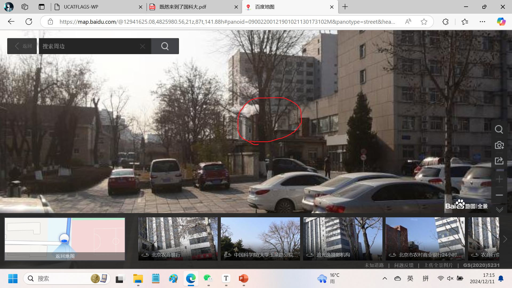

# 既然来到了国科大-WP

> Author: zl-wang
>
> Team: UNION SELECT team_name FROM teams --

尝试还原一下我和队友Racosel的解题过程，由于我们刚来美国不熟地方，只能用网上找到的街景地图辅助解题。百度地图上只有部分街景，不过加上我们一眼就能看出的地方，也足够解题了。

### 字母1

①看着比较破的红砖房，门口还能养狗，大概率是院内家属住的地方。校内符合该条件的地方只有西平房，在田径场西北方向。

②某个车库，我一开始觉得这个墙很像礼堂北边琴房门口，所以怀疑是不是礼堂东侧或者西侧的墙，尤其是西侧还有班车停靠，有概率就是这里，但查证后并未发现图示结构。不过班车给了我们线索，有没有可能是学校西南角的班车车队附近？此处没有百度地图全景无法验证，故只能作为猜想。

③大概率在某条路上，排查后发现在南门口的路和礼堂西路的路口，石头形状和上面的字正确。

④铜像和社会主义核心价值观很明显都是人文楼东侧的标志。雕像是朝南的，所以这是站在礼堂西侧的路上朝西拍的。

⑤明显在人文楼西侧，2021年笔者大一时人文楼装修，进出人文楼需要走西侧的小门，很容易注意到这里。此处在百度地图街景上没有显示，但是在卫星地图上有一个小圈。

将以上位置连在一起，可以得到小写字母b。

### 字母2

首先思考一下有什么两个壁画四个端点即可表示的大写字母，事实上可选项并不多，只有T和X满足要求。

1-①百度地图搜索“严济慈院长塑像”即可，在图书馆东南角。事实上玉泉路只有两座雕像，还有一座是人文楼东侧的郭沫若雕像。

1-②这样的门这样的窗一眼阶教，只有阶一6后门满足要求。

其实做到这里结论已经出来了，只能是X，因为上面两点连成了一条斜线。下面两个点我们也不能给出精确的位置和角度，仅作为参考。

2-①注意到图上的窗户有两种，一种是房间的窗户，一种是楼道的窗户，由此可以排除一公寓和二公寓。一公寓和二公寓的窗户排列时整齐的，且一公寓是落地窗，二公寓的窗户也不止两块玻璃，而是四块玻璃。我猜想这栋楼是二公寓东侧、小东门南侧的家属楼，虽然颜色和百度地图上的对不上（说明可能是刷过的），但窗户形状是正确的。至于这棵树，似乎不要求精确定位的话也没啥用。这里给出一个可能的位置，至少顶楼确实有两台空调外机。

2-②铁栅栏印象里只可能出现在学校南边和东边，其中东边的栅栏靠近玉泉路，上面没有这么多植物，而南边的栅栏外面是石景山路，确实有这么多植物。直觉告诉我这是办公楼对面，由于实在找不到街景或者卫星地图，具体位置需要实地考察。

虽然有些是猜出来的，但是不影响解题，基本可以确定对应的字母是X。

### 字母3

①明显只能是留学生公寓东侧的过道，可以通往驿站和小东门。

②明显是阶教大厅屋顶。

③注意到地上是砖，远处是灌木，基本可以肯定是教学楼正门外面的走廊。

④明显是麦叔西边的窗户。

⑤明显是小东门旁边，已经是你校经典位置了，不解释。

将以上位置连在一起，可以得到小写字母d。

### 字母4

①明显是图书馆东侧的走廊。

②高能所图书馆东侧的空地（事实上仍属于玉泉路），照片是在南边向北拍摄的，但由于街景角度不好，可以从东侧拍到图中右边的窗户，以及竹子和长椅。

③有这么多树说明肯定不是篮球场，要么是田径场要么是足球场。其实这里有好几个，不过具体是哪个无所谓。街景地图上只有冬季的照片，不过夏天上体育课的时候大概会对这个地方有印象吧......

④在观察以上三个运动场后，只有足球场西北角有个箱子。

将以上位置连在一起，可以得到小写字母z。事实上后两个猜不出来也没问题，只要直到第一个笔画是从左到右的一横，且一共3个笔画，基本就可以锁定小写字母z了，总之通过字母的笔画数判断也是很重要的（队友Racosel要求加上的）

### 字母5

①百度地图上有“北京高能电气设备安装队”，我相信去过图书馆的人应该不可能没见过这个地方吧......

②白色的楼基本可以确定是高能所旁边那几栋了，此为科研楼南边的柏树。

③有班车有玉泉大厦，和第一题一样是班车车队的停靠点。

④不知道在哪也无所谓，比如我就懒得找了。

⑤郭沫若像再次出现，不解释了，还是人文楼东边。

结合除第4点外的结论，基本可以确定此为大写字母G。

### 字母6

①常去西北吃饭的人应该能看出来四公寓北边的生活超市附近，现在附近开了水果超市不过我也好久不去了。

②典中典之校门口的校训，不知道的看眼街景就知道了。

③不知道无所谓，后面两个比较好猜。

④不认识这个架子无所谓，后面的海报不可能不认识吧？这是教学楼1楼大厅，电梯口前面保安桌子附近。

⑤食堂和一公寓女生中间，这个角度比较奇怪，相信平时男生肯定不会去。不过看下面这张街景就能看出来这个无障碍通道了。

另外远处这栋楼也可以在玉泉路的街景上找到对应的位置，虽然颜色不一样，但这只能说明百度地图上的资料太老了，比如玉泉路口北公交站的站牌就是旧的。

就算猜不出③，我们也可以大致确定答案为大写字母W。

### 字母7

①这个烟囱算是西北食堂那一块的标志吧，就是下图圈出来的这一块。结合前面有墙，大致确定在人文楼东边。

②前面讲过，见白楼知高能所。图中这里是楼的一角，所以基本只需要排查高能所到国科大的那几个路口。最东边二公寓对面的楼颜色不对，西边平房对面的楼侧面没有图中的树。只有是图书馆对面的楼完全符合要求，注意这两棵树之间的电线杆位置是完全一样的。

③显然是礼堂门口的草坪，而且是中轴线上的，有时在前面有时被搬到后面，不过这不重要。

④二公寓门口麦叔附近印象里有一个，街景上没有。

⑤阶教大厅楼顶，不解释。

将以上位置连在一起，可以得到大写字母M。

### 第8题

①留学生公寓附近，去澡堂的路上。你应该认识，除非你从来不去洗澡。

②礼堂草坪上，这块牌子则靠近教学楼，仔细看后面甚至拍到了台阶。

③结合后面的铁栅栏以及上面的植物可知这里是学校南边的墙，我又在街景上找了一圈没找到，不过这不重要。

④有没有可能这和上一题是同一块牌子？

⑤注意该体育场里有树以及地上是绿色的，所以不可能是篮球场，以及后面有红色的高楼，所以也不可能是田径场。所以这里是足球场正门，后面的建筑是食堂。

将以上位置连在一起，可以得到小写字母d。

综上所述，本题flag为`ucatflags{bXdzGWMd}`。

没时间在百度地图上标记坐标了，大家看个乐呵就行。如果本篇writeup存在错误，或根据我的描述无法找到对应位置，请联系我修改，谢谢🙏