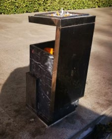

# 解题过程

## 1. 题目名称及描述

### 1.1. 题目名称

既然来到了国科大

### 1.2 题目描述

既然来到了国科大，就应该好好逛逛校园！跟上我的步伐，答案就在轨迹中（请在一张以上为北的地图中提取flag）。

## 2. 题目部署方法

提供附件给选手下载

### 2.1. 解题过程

根据题意，需要在国科大校园中找到照片所示地点，并在地图上连点成线，构成字母。

下面给出的解法仅仅是出题人视角中比较合理的分析方法，欢迎大家在群里讨论其它解法。

出题人希望这道题能带大家更深入地认识认识自己朝夕相处的国科大玉泉路校区，并为这次CTF带来一点不太一样的体验。

#### 第一张PPT

**图片1**：

&emsp;&emsp;根据背景的红砖墙和右下角的狗可以推断是在**图书馆西侧的那排民房**。如果你经常从这条小路过，那你一定对这条狗有印象，毕竟大多数时候它都会懒洋洋地躺在路边。

**图片2**：

&emsp;&emsp;显然这是一个地面上的车库。结合背景的墙面风格，容易发现是在**学校西南角，办公楼旁边的大巴车聚集地**。

**图片3**：

&emsp;&emsp;非常经典的一块石头，坐落在**南门西侧的草坪上**。这里不是大家上课或者出校的必经之路，所以虽然位置比较显眼，但仍然容易被忽视。可以通过草坪类型判断大致位置，这种草坪几乎只在南门附近和礼堂前有，而礼堂前显然是没有校训时以外的石头的。

**图片4**：

&emsp;&emsp;**人文楼东南角**。比较明显，图片上方还出现了郭沫若像。

**图片5**：

&emsp;&emsp;**人文楼西侧**的魔法阵。通过路面铺装风格可以推测应该是在人文楼附近，在此基础上推测背景里的墙应当是西北风味餐厅以东的围墙。

找到五个点后，连点成线得到小写英文字母“b”。

#### 第二张PPT

**图片1-1**：

&emsp;&emsp;**图书馆旁边的严济慈院长像**，比较显眼，甚至直接在百度地图上就有标出来。常去图书馆的同学都会记得这里吧。

&emsp;&emsp;虽然测试的同学在这个点被卡了。。。

**图片1-2**：

&emsp;&emsp;少数几个室内的点。首先排除宿舍，因为我们不可能把点定在一些只有特定人员可达的地方。结合装修风格（门、地板和外部瓷砖）可以排除人文楼、办公楼、礼堂。那么就只有去教学楼、阶教和食堂找了。最后可以找到是在**阶一6背后**。

&emsp;&emsp;考虑到有不少同学从阶一6后门逃人文讲座，我们认为这个点应该并不会特别难。

**图片2-1**：

&emsp;&emsp;根据背后的黄色墙面容易发现是在**留学生公寓西侧的民房**。仔细观察外墙的细节和银杏树，可以发现拍摄地点的大致位置是在**留学生公寓东北角拐角处**。

**图片2-2**：

&emsp;&emsp;根据右侧的围墙判断，应该是在学校南侧，因为只有南门附近才有这种墙。沿着墙走找图片中部出现的黄色环状物，可以发现是在**南侧草坪最西端贴墙处，停车场角落里**。

&emsp;&emsp;个人认为最难的一个点。我们特意找了一个比较刁钻的拍摄角度，绕到了这块牌子的正面拍摄；如果你沿着路走，一般情况下只能看到这块牌子的背面。

&emsp;&emsp;Sikesibian干的。

找到四个点后，根据PPT提示，连点成线得到大写英文字母“X”。

#### 第三张PPT

**图片1**：

&emsp;&emsp;结合贴砖风格和旁边的银杏树推断，应该是**留学生公寓东侧的楼梯**。

**图片2**：

&emsp;&emsp;根据天窗和露出的天线一角可以判断是在**阶教大厅**，更具体地来讲，是**东侧的那个天窗**。

&emsp;&emsp;这个点是我定的，我觉得是很棒的一个点，一个比较少见一点的视角。

&emsp;&emsp;其实这个点最开始的想法是拍这个天窗下面的那块时钟。

**图片3**：

&emsp;&emsp;**教学楼门口的垃圾桶**。如果我没记错的话，学校里应该只有这一个垃圾桶长这样。从地板和远处的绿植应该也能看出来是在教学楼门口哪里。

**图片4**：

&emsp;&emsp;**麦叔超市旁**。很简单的一个点，窗户上甚至还有“数码快印”，虽然不是很清晰。

**图片5**：

&emsp;&emsp;**小东门**旁的“中科大驻京办”，走过小东门的应该都会对这个点有印象。

找到五个点后，连点成线得到小写英文字母“d”。

#### 第四张PPT

**图片1**：

&emsp;&emsp;**图书馆旁的连廊**。旁边有车，所以肯定不是人文楼旁边的连廊。

**图片2**：

&emsp;&emsp;根据白色外墙可以判断应该是在靠近高能所的位置，因为只有那边才有白色建筑。沿着竹林找，最后发现是在**二公寓正门对面的树林里，位置比较隐蔽，但有一条小路可以通行**。

&emsp;&emsp;也是Sikesibian干的。在他定这个点之前，我也不知道学校里还有这地方。

**图片3**：

&emsp;&emsp;根据网状围墙和茂密的藤蔓可以确定是**田径场**，根据路灯配电箱锈迹形状以及右侧的大树相对位置，可以判断应该是在**田径场入口处**。如果仔细观察，你还会发现图片左侧的树影中有另一盏路灯。

**图片4**：

&emsp;&emsp;根据右上角可以判断是在一块广告牌背后，根据植被类型可以发现是**一公寓与礼堂东路交界处的配电箱**。这个点也比较明显，毕竟大家经常从这里过。

找到四个点后，根据PPT提示，连点成线得到小写英文字母“z”。

#### 第五张PPT

**图片1**：

&emsp;&emsp;**图书馆东南侧马路对面**。常去图书馆的应该对这里也有印象。如果你实在不知道，建议根据外墙排查。这种墙面基本上只在人文楼西侧和篮球场北侧有。

**图片2**：

&emsp;&emsp;根据背景的白色外墙来看，应该是靠近高能所的建筑。最终可以发现是**图书馆西南角的一棵树，应该是柏树吧**。

**图片3**：

&emsp;&emsp;学校里停大巴车的就教学楼旁边和办公楼附近。根据背景的低矮建筑可以排除教学楼，再根据背景里远处的玉泉大厦外墙，可以找到是**学校西南角**。

&emsp;&emsp;也可以把房顶上那个奇形怪状的物体当做标志物。

**图片4**：

&emsp;&emsp;观察植被类型，这种草基本只在办公楼附近才有。在办公楼附近找，可以发现是在**办公楼东南角的草坪中**。也可以通过标志牌形状来筛选。

&emsp;&emsp;这个点是我定的，主要是想考察对背景细节的辨识和分析。

**图片5**：

&emsp;&emsp;**人文楼东南角广场上的郭沫若像**。很明显。

找到五个点后，连点成线得到大写英文字母“G”。

#### 第六张PPT

**图片1**：

&emsp;&emsp;**田径场西侧**。如果你常去操场跑步或者去玉泉超市买东西，应该会对这片蓝色的屋顶有印象。

**图片2**：

&emsp;&emsp;**正对南门的校训石上的落款**。没有更多信息，只能逐个排查石头了。

&emsp;&emsp;我干的。本来是想拍整个校训石的，但想了想觉得太简单了，就只截取了局部细节。

**图片3**：

&emsp;&emsp;一样分析植被类型，这种植被只在足球场门前才有，结合标志牌发现是在**足球场大门左侧的草坪中**。

&emsp;&emsp;这个点也是我定的。

**图片4**：

&emsp;&emsp;**教学楼门口的书架**。几乎是必经之路。根据地板、背景墙面和露出一角的保安台可以判断。

**图片5**：

&emsp;&emsp;首先，从左上角可以发现，这里可以看到学校外面，所以应该贴着墙找。其次，这里紧邻着一栋建筑，并且从门的风格来看应该是校内的建筑，而且和围墙有一定空隙，所以可以排除南侧围墙和一、二公寓，那么就只能是食堂了。最后可以发现是**食堂北侧与一公寓女生宿舍之间**。

找到五个点后，根据PPT提示，连点成线得到大写英文字母“W”。

#### 第七张PPT

**图片1**：

&emsp;&emsp;**人文楼西侧**。看外墙，这种墙几乎只在篮球场北侧和人文楼西侧有，根据树和红砖墙的建筑排除篮球场北侧，那就只能是人文楼西侧了。

&emsp;&emsp;这个点是我定的，其实一开始只想给图中那个蓝绿色的通风管道，但讨论后觉得太阴间了。

**图片2**：

&emsp;&emsp;根据白色外墙推断应在高能所附近，再根据梧桐树和地上堆积的树枝、远处若隐若现的围墙可以发现是在**图书馆东侧通往高能所的路边，就在马路对面**。

**图片3**：

&emsp;&emsp;**礼堂门口的草坪上**。需要注意的是，人文楼旁边也有一个类似的标志，但那个的“UCAS”是白色的，并且草坪的类型也与此处不同。

**图片4**：

&emsp;&emsp;看上去除了一个旧衣物回收箱之外没有更多信息，但仔细背景可以发现，它立在一片泥地上，并且前面是一条红色的人行道，所以它应该是**二公寓对面的那个旧衣物回收箱**。

&emsp;&emsp;这个点是我定的，我对照片进行了裁剪，特地裁掉了大部分的周围环境，但仍然保留了足够多的信息。

**图片5**：

&emsp;&emsp;**阶教顶上的天线，从食堂前面那条路上看过去的视角**。也是很明显的一个点。

找到五个点后，根据PPT提示，连点成线得到大写英文字母“M”。

#### 第八张PPT

**图片1**：

&emsp;&emsp;**二公寓西北角的树**。几乎是去澡堂的必经之路。

**图片2**：

&emsp;&emsp;**教学楼旁边的草坪上**。送分题。

**图片3**：

&emsp;&emsp;职工班车时刻表，不是学生的。根据远处的围墙可以推测应该是在学校南侧的草坪前，最后发现是在**学校南门以西草坪前**。

**图片4**：

&emsp;&emsp;**人文楼东侧的草坪上**。注意与礼堂草坪上的标志区分，主要是“UCAS”的颜色，以及草坪类型和落叶（礼堂草坪上没有梧桐树）。

**图片5**：

&emsp;&emsp;**足球场门口上的告示**。显然这里应该是一处体育场，再根据绿色的地面可以确定就是足球场，去足球场入口就能发现。

找到五个点后，连点成线得到小写英文字母“d”。

## 3. 相关问题

### 3.1 题目分值

**500分**

考虑到这道题可能需要大量时间（测试同学给出的预估时间是4h），所以给了最高分值。

### 3.2 题目flag

`ucatflags{bXdzGWMd}`

flag对应于校训“博学笃志，格物明德”的拼音首字母。

flag似乎有点简单了，但没办法，出太复杂的话做题人折磨，出题人也折磨（排布这些点来构成字母真的很麻烦）。

### 3.3 其它

这个题一开始的想法是，找几个中科院研究所，在百度地图上用全景模式找几个附近的点截图，让大家找。最后将找到的研究所按英文简称拼成flag。这样出的话就是比较经典的“网络谜踪”式的题目。后来觉得这个方案不够好玩，所以就放弃了。

早期的方案中，没有打算告诉大家如何提取字符，但Sikesibian坚持认为这种方案过于接近puzzle hunt，失去了CTF比赛“考点明确”的特征，所以作罢。

早期的方案中，打算把学校划分成若干方块，取格点拍照，这样会比较方便画字符。这也是为什么我们没有在西北还有三公寓那边取点。不过后来拍照的时候发现有些很有意思的点不在格点上，所以这个方案也作废了。

题目名称自然是来自于疫情时期的果壳圣经“既然来到了国科大，就应该……”。原本也考虑过用“安贫乐道，舍身报国”当flag，但Sikesibian觉得这样不好。

出这道题的时候，我希望它能给大家带来一点小小的国科大震撼，让大家走出宿舍，好好地逛一逛校园。我希望大家会觉得它是一道好玩的题目，一道努努力还是能做出来的题目，而不是一道令人绝望的题目。